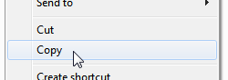

# MP4 Lossless Rotator

<p align="center">
	<b>Rotate MP4 videos instantly and losslessly by changing the rotation matrix—no re-encoding required!</b><br>
	<a href="https://github.com/vanowm/MP4-Lossless-Rotator/releases/latest"></a>
	<a href="https://github.com/vanowm/MP4-Lossless-Rotator/blob/master/LICENSE"></a>
</p>

---

This tool rotates MP4 files losslessly by modifying the rotation matrix in the track header. No video or audio data is re-encoded, so the process is instant and quality is preserved.


## Download

**[Download for Windows (latest release)](https://github.com/vanowm/MP4-Lossless-Rotator/releases/latest/download/mp4-rotator-x86_64-pc-windows-msvc.zip)**


## Usage

### 1. Command Line

Specify one or more file paths:

```sh
mp4-rotator C:\path\to\video1.mp4 C:\path\to\video2.mp4 C:\path\to\video3.mp4
```

### 2. Clipboard

Copy the file(s) in Windows Explorer:

<p align="center"></p>

Then simply run:

```sh
mp4-rotator
```

---

By default, the tool rotates 90° clockwise from the current rotation. You can change this and other options with command line parameters:

|   Parameter   |   Description   |
|:------------:|:---------------:|
| `--rotate=`*`nn`* or `-r=`*`nn`* | Set rotation to *`nn`* degrees. Accepted: `0`, `90`, `180`, `270`. |
| `--backup` or `-b` | Backup original file (creates a backup with a date suffix). |

Example:

```sh
mp4-rotator --rotate=180 --backup C:\path\to\video1.mp4 C:\path\to\video2.mp4
```

---

### Configuration File

If present, `mp4-rotator.ini` in the same directory as the executable will be loaded for default options.
See [`mp4-rotator_example.ini`](https://github.com/vanowm/MP4-Lossless-Rotator/blob/master/mp4-rotator_example.ini) for available parameters.

---

## Example Output

The tool prints detailed information about its process and aborts if it encounters anything unexpected in the file:

```text
Start
Processing file: C:\test\Marea.mp4 (forced rotation: 180°)
Found moov box at 32
Found trak box at 148
Walking trak -> mdia -> hdlr
Track type: vide
Found trak box at 34333
Walking trak -> mdia -> hdlr
Track type: soun
Found video track
Rotation matrix found: 0° => changing to: 180°
Writing new rotation matrix: success
Finished.
```


## Credits

- Based on the [original repository](https://gitlab.com/AndreKR/mp4-rotator) by [André Hänsel](https://gitlab.com/AndreKR)
- Thanks to user aXeL-HH on StackOverflow for publishing [this method](https://stackoverflow.com/questions/25031557/rotate-mp4-videos-without-re-encoding/49535017#49535017)


## TODO
* Linux version (by target gating the clipboard functionality)
